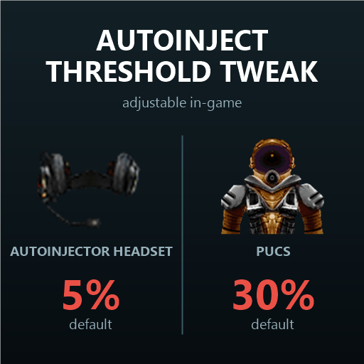

# Autoinject Threshold Tweak

A [Barotrauma](https://barotraumagame.com/) mod that lets you choose, right in the game, at what health the **Autoinjector Headset** and the **PUCS** use the medicine inside them.

In vanilla both items always inject at 50% health. With this mod every item has its own setting from 0% to 95%, saved with the campaign and synced in multiplayer.

| Item | Vanilla | Mod default |
|---|---|---|
| Autoinjector Headset (Medic talent) | 50% | 5% |
| PUCS (Engineer talent) | 50% | 30% |



## How to use

**Right-click the item in your inventory** (worn, held or in your backpack) to open its settings window. The window shows the item's name, so you always know which one you're changing. Close it with the ✕ button or by right-clicking the item again.

## Requirements

- [Lua For Barotrauma](https://steamcommunity.com/sharedfiles/filedetails/?id=2559634234) powers the settings window. In multiplayer it must also be installed on the server.
- Without Lua the items still work with the default values, there's just no way to change them.

Built for Barotrauma 1.13.4.0. Not compatible with other mods that override `autoinjectorheadset` or `pucs`.

## How it works

- `Items/*.xml` are full overrides of the vanilla items. The only changes are marked `CHANGED` / `ADDED`: a default `autoinjectthreshold` on the `ItemContainer` and a hidden `CustomInterface` with an integer input.
- That input stores the percentage in the component's own `ManuallySelectedSound` property: an int that the game already saves and syncs in multiplayer, and that does nothing on a component without sounds. The `CustomInterface` itself is never drawn (`drawhudwhenequipped="false"`).
- `Lua/Autorun/AutoinjectThreshold.lua`:
  - copies that percentage into `ItemContainer.AutoInjectThreshold` (server and client). The game doesn't save the threshold itself, so this also restores it after loading a save;
  - on the client, opens its own settings window when one of the items is right-clicked in the player's inventory. New values are typed into the hidden `CustomInterface` input, which runs the vanilla code that stores the value and sends it to the server.

## Repository layout

```
AutoinjectThresholdTweak/   the mod itself (this folder is what gets published)
  filelist.xml
  Items/                    item overrides
  Lua/Autorun/              Lua script
  Texts/                    panel label (English, Russian)
  PreviewImage.png          Workshop thumbnail
workshop/description.txt    Steam Workshop description (BBCode)
tools/make-preview.ps1      regenerates PreviewImage.png from game icons
```

## Development setup

Link the mod folder into the game's `LocalMods` instead of copying it, so the game always loads the files from the repository (PowerShell, no admin rights needed):

```powershell
New-Item -ItemType Junction -Path "C:\Program Files (x86)\Steam\steamapps\common\Barotrauma\LocalMods\medmod" -Target "<path to repo>\AutoinjectThresholdTweak"
```

Keep the `.git` folder out of the mod folder: the game uploads everything inside it when publishing to the Workshop.

## Updating after a game patch

The items are full overrides, so after Barotrauma updates the vanilla items (prices, recipes, stats) the mod keeps the old versions. Re-copy them from `Content/Items/Jobgear/Engineer/engineer_talent_items.xml` and `Content/Items/Jobgear/Medic/medic_talent_items.xml`, re-apply the `CHANGED` / `ADDED` parts, then bump `gameversion` and `modversion` in `filelist.xml`.

---

## Кратко по-русски

Мод для Barotrauma: порог автоинъекции гарнитуры-автоинъектора и УЗК настраивается прямо в игре (0–95%, по умолчанию 5% и 30%). Окно настройки открывается правым кликом по предмету в инвентаре, в заголовке указано название предмета, закрывается крестиком или повторным правым кликом. Нужен [Lua For Barotrauma](https://steamcommunity.com/sharedfiles/filedetails/?id=2559634234), в мультиплеере и на сервере тоже.
